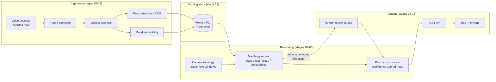

# multicam-tracker

Multi-camera object tracking and path reconstruction.

Given a target identifier — primarily a vehicle license plate, with visual
re-identification as a fallback — the system ingests video from several cameras
(recorded or live), detects vehicles, records every sighting, and reconstructs
the target's movement across cameras using synchronized timestamps and a camera
topology graph. The output is a timeline plus a map.

The motivating use case is stolen-vehicle tracking: enter a plate, get back
which cameras saw it, when, and the route it took.

> **Status: stage 01 of 20.** The foundation (config, logging, exceptions,
> clock, CI) exists. No domain logic yet. See [Build order](#build-order).

---

## Pipeline



Two properties shape the whole design:

**Plate first, appearance second.** Exact plate match wins; fuzzy match tolerates
the OCR confusions that actually happen (`0/O`, `1/I`, `8/B`); embeddings are a
fallback for when the plate is unreadable, never a silent substitute for it.

**Topology prunes, it does not decorate.** A candidate sighting at camera B is
only considered if the elapsed time since camera A falls inside that link's
plausible travel-time window. This is what keeps a mid-chain false positive out
of a reconstructed route.

Nothing is silently promoted to certainty: every match and every hop carries an
explicit confidence, and anything below the auto-accept threshold goes to a
human before it enters a confirmed trajectory.

---

## Quickstart

**Prerequisites:** Python 3.11+, [uv](https://docs.astral.sh/uv/), and Docker
(for the database and integration tests).

```bash
git clone <repo> && cd multi-camera-tracking
cp .env.example .env          # optional; defaults work without it
make install                  # or: .\scripts\dev.ps1 install
make db-up                    # Postgres 16 + pgvector
make ci                       # lint + types + tests
```

On Windows without GNU make, `scripts/dev.ps1` mirrors every target:

```powershell
.\scripts\dev.ps1 install
.\scripts\dev.ps1 ci
```

The CV stack (`torch`, `ultralytics`, `paddleocr`) is an optional extra and is
**not** needed before stage 11:

```bash
make install-vision
```

---

## Configuration

Everything is configured through environment variables prefixed `MCT_`, with
`__` separating a section from a field:

```bash
MCT_DATABASE__PORT=5544
MCT_THRESHOLDS__PLATE_FUZZY_MAX_EDIT_DISTANCE=1
```

Precedence, highest first: constructor arguments → environment variables →
`.env` → `config/thresholds.yaml` → field defaults. See [.env.example](.env.example)
for the full list.

Decision thresholds live in [config/thresholds.yaml](config/thresholds.yaml) and
have **no defaults in Python** — a threshold missing from the YAML fails at
startup rather than quietly falling back to a magic number.

No secret has a default value. `database.password` and `api.secret_key` are
empty unless configured.

---

## Tests

```bash
make test-unit          # fast, no docker, no network
make test-integration   # spins up Postgres via testcontainers
make test-all           # everything, with the 85% coverage gate
make coverage           # HTML report in htmlcov/
```

Integration tests skip cleanly when Docker is unavailable.

Markers: `unit`, `integration`, `slow`, `requires_gpu`, `requires_models`.

---

## Layout

| Path | Contents |
|---|---|
| `src/multicam_tracker/` | Main package |
| `├── config.py` | Pydantic Settings, thresholds loading |
| `├── exceptions.py` | Exception hierarchy rooted at `MulticamTrackerError` |
| `├── logging_config.py` | structlog setup, correlation ids |
| `├── clock.py` | Injectable clock (`SystemClock` / `FixedClock`) |
| `├── models/` | Domain models — stage 02 |
| `├── db/` | SQLAlchemy models, repositories, migrations — stage 03 |
| `├── topology/` | Camera graph and travel-time constraints — stage 04 |
| `├── matching/` | Plate and embedding matching — stages 06-07 |
| `├── pathing/` | Trajectory assembly — stage 08 |
| `├── ingest/` | Video sources and sampling — stage 10 |
| `├── vision/` | Detection, OCR, embeddings — stages 11-13 |
| `├── pipeline/` | Orchestration — stages 14-15 |
| `├── api/` | FastAPI routes — stage 16 |
| `├── review/` | Human review workflow — stage 18 |
| `└── observability/` | Metrics, tracing, governance — stage 19 |
| `web/` | Map + timeline frontend — stage 17 |
| `config/` | Camera topology and thresholds |
| `tests/unit/`, `tests/integration/` | Mirror the package structure |
| `docs/` | Architecture and operations |

---

## Build order

Stages 05–08 land **before** any computer vision. The synthetic data generator
produces ground truth, so the matching and pathing engines can be measured
precisely before real video introduces uncertainty about what the correct answer
even is. By the time CV arrives in stages 11–13, everything consuming it is
already validated.

Full stage map: [coding-agent-prompts/README.md](coding-agent-prompts/README.md).
Architecture detail: [docs/ARCHITECTURE.md](docs/ARCHITECTURE.md).
Requested capabilities not yet in the staged plan: [docs/FEATURE_BACKLOG.md](docs/FEATURE_BACKLOG.md).

## Picking this up

Start at **[HANDOFF.md](HANDOFF.md)** — where the work stands, and what to do
next. From there:

| document | answers |
|---|---|
| [docs/PROJECT_STATUS.md](docs/PROJECT_STATUS.md) | what each finished stage delivered and measured |
| [docs/TODO.md](docs/TODO.md) | what is left, including debts that are not stages |
| [docs/WORKING_AGREEMENT.md](docs/WORKING_AGREEMENT.md) | protocol, environment traps, commands |
| [docs/DECISIONS.md](docs/DECISIONS.md) | settled decisions and fixed bugs -- do not re-litigate |
Working conventions: [CONTRIBUTING.md](CONTRIBUTING.md).

---

## Operating constraints

This system processes surveillance footage and vehicle identifiers. The
following are treated as functional requirements, not appendices:

- **Audit logging** — every target search, match confirmation, and rejection is
  recorded with actor, timestamp, and query parameters.
- **Retention** — sightings and thumbnails carry a configurable TTL with an
  automated purge.
- **Confidence surfacing** — no interface presents a low-confidence match as a
  confirmed one.
- **Human review gate** — matches below the auto-accept threshold require
  explicit confirmation before entering a confirmed trajectory.
- **Access control** — write and confirm operations require an authenticated
  actor identity for the audit trail.
