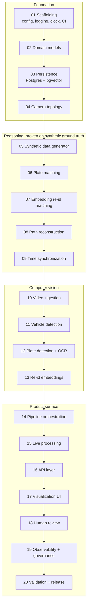
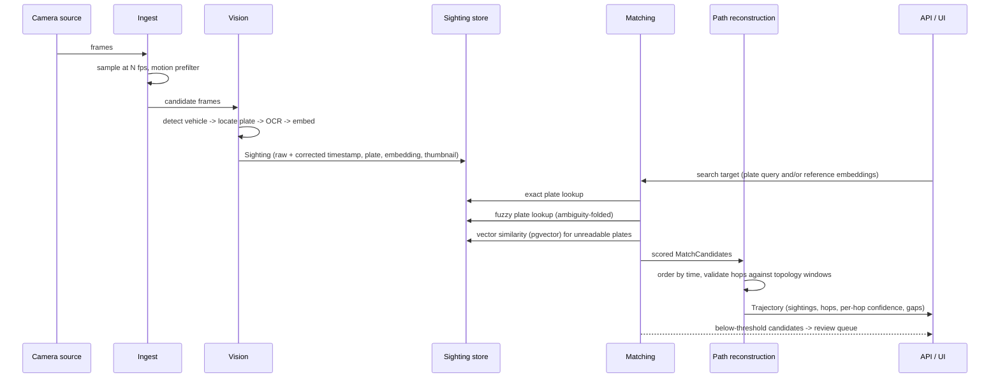

# Architecture

This document restates the pipeline and explains why it is shaped the way it is.
It is the reference a new stage prompt should be read against. Schemas are
authoritative in
[`coding-agent-prompts/00_GLOBAL_CONTRACT.json`](../coding-agent-prompts/00_GLOBAL_CONTRACT.json);
this document does not redefine them.

---

## 1. The problem

Cameras are independent. Each one knows only what passed in front of it, and
each one has its own clock, its own angle, and its own idea of what a license
plate looks like at 40 km/h in bad light. The system's job is to turn that pile
of independent observations into one answer to one question: *where did this
vehicle go?*

Three things make that hard, and each one drives a design decision:

| Problem | Consequence | Design response |
|---|---|---|
| OCR is unreliable | The same plate reads differently at different cameras | Fuzzy matching over ambiguity-folded forms, plus an embedding fallback |
| Cameras drift | Two sightings can appear out of order | Per-camera clock offsets applied at ingest; `timestamp_utc` is always corrected (stage 09) |
| False positives look identical to true ones | A wrong sighting mid-route silently invents a journey | Topology-constrained search and confidence-scored hops, never a boolean |

---

## 2. Stage flow



### Why the brain comes before the eyes

Stages 05–08 build and validate the matching and pathing logic against
synthetically generated sightings with known ground truth, before any real video
exists. This is the single most important structural decision in the plan.

If CV came first, every wrong trajectory would have two possible causes — bad
detection or bad logic — and no way to tell them apart. With ground truth in
hand, the logic's accuracy is a measured number. When real footage arrives, any
regression is attributable to the vision layer by elimination.

---

## 3. Data flow



---

## 4. Foundation modules (stage 01)

These four exist to make every later stage's tests possible.

### `config.py`

Single entry point for all configuration. Nothing in `src/` hardcodes a host,
path, credential, or threshold.

Thresholds are the notable case: every field of `ThresholdSettings` is
**required with no Python default**, so the values can only come from
`config/thresholds.yaml`. That converts "no magic numbers in logic" from a
convention into a startup assertion — a threshold added to the model but
forgotten in the YAML fails immediately and loudly.

### `exceptions.py`

One root, `MulticamTrackerError`, so a caller can catch the whole family. Each
error carries an optional structured `context` mapping rendered into `str()` and
available to log processors — the offending field, the camera id, the threshold
that was violated.

### `logging_config.py`

structlog with two renderers over one shared processor chain: JSON for
production, console for development. Sharing the chain means a field that exists
in dev also exists in prod.

Third-party stdlib loggers are routed through the same formatter, so SQLAlchemy
and uvicorn output lands in the same stream in the same shape.

A `correlation_id` bound via `bind_correlation_id()` rides on every subsequent
record. It lives in a `ContextVar`, so the concurrent camera streams of stage 15
each get an isolated copy.

### `clock.py`

Nothing calls `datetime.now()` directly. Code takes a `Clock` and calls
`now_utc()`. Production injects `SystemClock`; tests inject `FixedClock` and get
a deterministic instant with no patching and no sleeping.

This matters more here than in most projects: the entire system reasons about
elapsed time between sightings, so a test that cannot pin "now" cannot assert
anything about travel-time plausibility.

`ensure_utc()` rejects naive datetimes outright rather than guessing whether
they mean local time, camera time, or UTC — a wrong guess would corrupt every
downstream elapsed-time calculation.

---

## 5. Confidence model

Confidence is a first-class output, not a debugging aid.

```
match_confidence  = f(OCR plate confidence, match method weight,
                      edit-distance penalty, embedding cosine similarity)

hop_confidence    = f(confidence of both endpoint matches,
                      temporal plausibility vs the CameraLink window,
                      whether a topology link exists at all)
```

A hop whose elapsed time falls outside its link's window is **penalised, not
discarded**. An implausible transit may still be real — a detour, a stop, a
parked hour — and the score is what surfaces that doubt to the operator instead
of hiding it behind a boolean.

The bands:

| Band | Plate | Embedding | Outcome |
|---|---|---|---|
| Auto-accept | confidence ≥ 0.85 | cosine ≥ 0.92 | Enters the trajectory |
| Review | below auto-accept | 0.75 ≤ cosine < 0.92 | Queued for a human (stage 18) |
| Discard | — | cosine < 0.75 | Never shown |

---

## 6. Governance

These are functional requirements specified alongside the features they
constrain, because they are far harder to retrofit than to build in.

| Requirement | Where it lands |
|---|---|
| Audit logging of every search, confirmation, and rejection | Stage 18 |
| Configurable retention TTL with automated purge | Schema stage 03, job stage 18 |
| Confidence displayed alongside every result | Stages 16–17 |
| Human confirmation required below auto-accept | Stages 16 and 18 |
| Authenticated actor identity on write and confirm | Stage 16 |

> **Note on the contract's stage references.** The global contract's
> `operational_and_ethical_constraints` block cites stage 16 for the human review
> gate and stage 14 for access control. Per the stage map those belong to stages
> 18 and 16 respectively. The table above uses the stage map's numbering.

---

## 7. Open decisions

Carried forward from the plan, to be resolved at the stage that forces them:

- Which detection/OCR models to fine-tune versus use off the shelf (stages 11–12)
- Vector index choice beyond PoC scale — pgvector, FAISS, or Milvus (stage 19)
- How travel-time windows get computed in production — road-network API versus
  manual config (stage 04 ships manual; production is deferred)
- Shape of the low-confidence review UI (stage 18)
